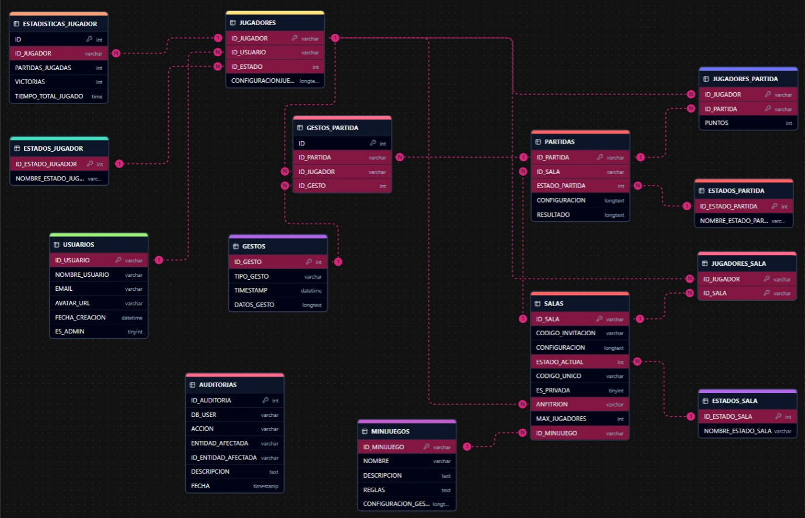

El diagrama de entidad-relación representa la estructura lógica de la base de datos de Gesture Battle Online. Define entidades clave como usuarios, jugadores, salas, partidas, minijuegos, gestos y sus estadísticas, junto con sus atributos principales y relaciones. Se modelan diferentes estados para jugadores, salas y partidas, permitiendo el control del flujo del juego. Las relaciones reflejan cómo los jugadores se asocian a salas y partidas, cómo se registran los gestos realizados y cómo se almacenan configuraciones y resultados en formato JSON. También se incluye la vinculación entre jugadores y sus cuentas de usuario, así como la asociación entre partidas y sus respectivos minijuegos, permitiendo una gestión estructurada y escalable del sistema de juego multijugador.