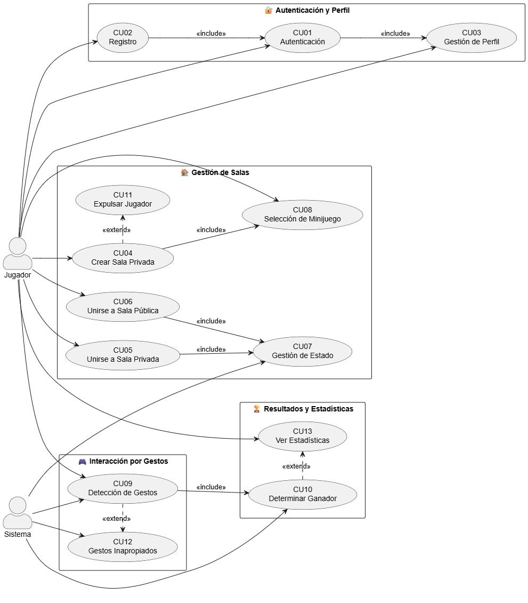

# Diagrama de Casos de Uso

---

## CU01 – Autenticación de Usuarios

**Actores:** Jugador  
**Precondición:** El jugador tiene instalada la aplicación y cuenta con conexión a internet.  
**Postcondición:** El jugador accede al sistema con sesión activa y su información sincronizada.

### Flujo Principal

1. El jugador inicia el sistema.
2. Se presentan opciones de autenticación: Google, Facebook, correo y contraseña.
3. El jugador selecciona un método e introduce sus credenciales.
4. El sistema verifica las credenciales con Firebase.
5. Si son válidas, carga perfil, avatar y estadísticas.
6. Se activa la sesión y se redirige al menú principal.

### Flujos Alternos

- **3a.** Credenciales inválidas: Se muestra mensaje de error.
- **4a.** Cuenta ya existente: Se previene duplicación por ID externo.
- **5a.** Error de red: Se informa y permite reintentar.

---

## CU02 – Registro de Usuarios

**Actores:** Jugador  
**Precondición:** No cuenta con una cuenta previa.  
**Postcondición:** Se crea un nuevo perfil y se inicia sesión.

### Flujo Principal

1. El jugador selecciona "Registrarse".
2. Introduce datos requeridos (nombre, correo, contraseña).
3. El sistema valida los datos.
4. Firebase crea la cuenta y un documento en Firestore.
5. Se sincroniza el progreso inicial y se inicia sesión.

### Flujos Alternos

- **3a.** Correo ya registrado: Se solicita otro correo.
- **4a.** Error de red: Se muestra mensaje y permite reintento.

---

## CU03 – Gestión de Usuario

**Actores:** Jugador autenticado  
**Precondición:** El jugador está autenticado.  
**Postcondición:** Se actualiza o consulta el perfil.

### Flujo Principal

1. El jugador accede a la sección "Mi Perfil".
2. Puede ver estadísticas, nombre, avatar, historial.
3. Puede modificar nombre o avatar.
4. Cambios se reflejan en Firebase en tiempo real.

### Flujos Alternos

- **3a.** Restablecer contraseña: Se envía enlace por correo.
- **3b.** Eliminar cuenta: Se solicita confirmación doble y se borra el documento de Firestore.

---

## CU04 – Crear Sala Privada

**Actores:** Jugador autenticado  
**Precondición:** El jugador está autenticado.  
**Postcondición:** Se crea una sala con código único registrada en Firebase.

### Flujo Principal

1. El jugador accede a "Crear Sala Privada".
2. El sistema genera un código único (ej. 6 caracteres).
3. Se registra en Firebase con datos del anfitrión.
4. El jugador puede configurar tipo de minijuego.
5. Queda a la espera de otros jugadores.

---

## CU05 – Unirse a Sala Privada

**Actores:** Jugador autenticado  
**Precondición:** La sala existe y no está llena ni en juego.  
**Postcondición:** El jugador entra a la sala correctamente.

### Flujo Principal

1. El jugador accede a "Unirse por Código".
2. Introduce el código compartido.
3. El sistema busca la sala.
4. Si es válida, añade al jugador y notifica al anfitrión.

### Flujos Alternos

- **3a.** Código inválido: Muestra error.
- **4a.** Sala llena o en partida: Se deniega acceso.

---

## CU06 – Unirse a Sala Pública

**Actores:** Jugador autenticado  
**Precondición:** Existen salas públicas disponibles.  
**Postcondición:** El jugador accede a una sala pública.

### Flujo Principal

1. El jugador accede a "Buscar Sala Pública".
2. Se listan salas públicas disponibles.
3. El jugador elige una o el sistema lo asigna automáticamente.
4. Se añade al jugador y se actualiza la lista de participantes.

---

## CU07 – Gestión de Estado de Usuario

**Actores:** Sistema, Jugador  
**Precondición:** El jugador está conectado.  
**Postcondición:** El estado del jugador se sincroniza y refleja en pantalla.

### Flujo Principal

1. El jugador se conecta, entra a sala o empieza partida.
2. El sistema actualiza el estado (ej. conectado, listo, en juego).
3. El estado se sincroniza vía Firebase o FishNet.
4. Otros jugadores visualizan el estado actualizado.

---

## CU08 – Selección de Minijuego

**Actores:** Jugador anfitrión o sistema  
**Precondición:** Hay al menos dos jugadores en sala.  
**Postcondición:** Se selecciona un minijuego y se comunica a todos.

### Flujo Principal

1. El anfitrión selecciona manualmente el minijuego o  
2. El sistema selecciona uno al azar.  
3. Se notifica el minijuego a todos los jugadores.  
4. Se prepara la lógica del minijuego en la escena.

---

## CU09 – Detección de Gestos en Tiempo Real

**Actores:** Sistema, Jugador  
**Precondición:** El jugador tiene cámara funcional.  
**Postcondición:** Los gestos se traducen en acciones de juego.

### Flujo Principal

1. El jugador se posiciona frente a la cámara.
2. MediaPipe detecta gestos (manos, cuerpo, rostro).
3. El sistema interpreta y traduce los gestos en acciones (moverse, activar, etc).
4. Se aplica lógica del minijuego.
5. Se garantiza baja latencia y precisión.

---

## CU10 – Determinación Automática de Ganador

**Actores:** Sistema  
**Precondición:** Finaliza un minijuego.  
**Postcondición:** Se anuncia el ganador y se guardan los resultados.

### Flujo Principal

1. El sistema evalúa desempeño de los jugadores.
2. Aplica reglas del minijuego.
3. Determina al ganador o empate.
4. Muestra pantalla de resultados.
5. Guarda estadísticas en Firebase.

---

## CU11 – Expulsar Jugador

**Actores:** Jugador (Anfitrión)  
**Precondición:** El jugador es el creador de una sala privada.  
**Postcondición:** Un jugador es removido de la sala y su estado es actualizado.

### Flujo Principal

1. El anfitrión visualiza la lista de jugadores en la sala.
2. Selecciona a un jugador que desea expulsar.
3. El sistema solicita confirmación.
4. Se expulsa al jugador y se actualiza el estado de la sala.
5. El jugador expulsado es notificado y redirigido al menú principal.

### Flujos Alternos

- **2a.** Selección inválida: El jugador no existe o ya salió de la sala.
- **4a.** El anfitrión cancela la acción: No ocurre expulsión.

---

## CU12 – Detección de Gestos Inapropiados

**Actores:** Sistema  
**Precondición:** El sistema está ejecutando detección de gestos en tiempo real.  
**Postcondición:** Se detecta y gestiona un gesto considerado ofensivo.

### Flujo Principal

1. El sistema detecta un gesto mediante MediaPipe.
2. Compara contra una base de gestos prohibidos (modelo ML o lista predefinida).
3. Si se identifica un gesto ofensivo:
   - Se registra el evento con timestamp y jugador.
   - Se muestra advertencia al jugador.

### Flujos Alternos

- **2a.** Gesto ambiguo o sin clasificación: Se ignora y continúa el juego.
- **3a.** Gesto reiterado: Se activa una Cloud Function que suspende temporalmente al jugador o lo reporta.

---

## CU13 – Ver Estadísticas del Jugador

**Actores:** Jugador  
**Precondición:** El jugador ha completado al menos una partida.  
**Postcondición:** Las estadísticas son mostradas en pantalla.

### Flujo Principal

1. El jugador accede a la sección "Estadísticas".
2. El sistema recupera los datos desde Firebase Firestore.
3. Se muestran:
   - Número de partidas jugadas
   - Minijuegos ganados
   - Tiempo total jugado
   - Última vez conectado
   - Racha de victorias (si aplica)

### Flujos Alternos

- **2a.** Error de red: Se notifica al jugador y se permite reintentar.
- **3a.** Jugador sin historial: Se muestra mensaje informativo como “Aún no has jugado ninguna partida”.
