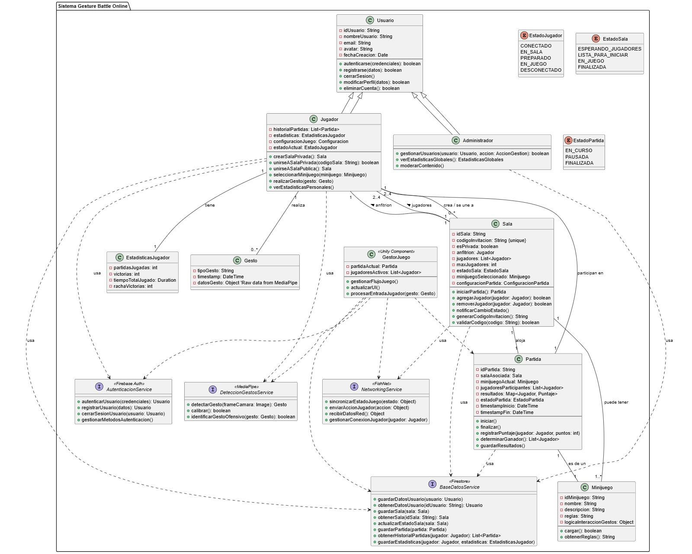

El diagrama de clases define usuarios (jugadores y administradores), salas de juego con diferentes estados, minijuegos, partidas en curso y el seguimiento de estadísticas y gestos de los jugadores. También ilustra la interacción del sistema con servicios externos para autenticación, base de datos, detección de gestos y funcionalidades de red, así como un componente de Unity para la gestión del juego
