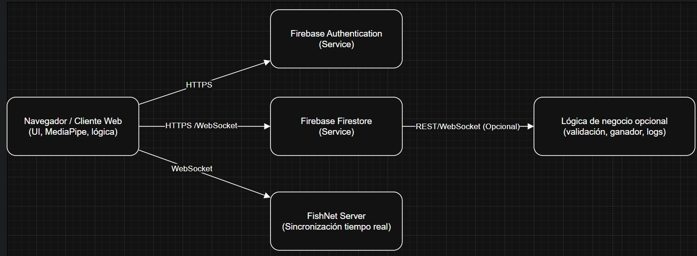

# Diagrama de Despliegue

## Componentes del Sistema

### Navegador / Cliente Web

**Tecnologías involucradas:** UI, MediaPipe, lógica del juego

- Punto de entrada del usuario al sistema.
- Contiene:
  - Interfaz gráfica del videojuego.
  - Motor de reconocimiento de gestos con MediaPipe.
  - Lógica del juego para interacción en tiempo real.
- Se comunica con servicios externos para autenticación, sincronización y almacenamiento de datos.

### Firebase Authentication

**Tipo:** Servicio en la nube

- Permite autenticar usuarios mediante Google, Facebook o correo y contraseña.
- Ofrece autenticación segura, rápida y gestión de sesiones activas.

### Firebase Firestore

**Tipo:** Servicio en la nube

- Base de datos en tiempo real.
- Almacena información como usuarios, salas, estadísticas y configuraciones del juego.
- Mantiene sincronizado el estado del juego entre los usuarios conectados.

### FishNet Server

**Funcionalidad:** Sincronización en tiempo real

- Servicio de red que permite la comunicación entre jugadores con baja latencia.
- Refleja el estado de cada jugador (conectado, en sala, jugando, etc.) usando WebSockets.

### Lógica de Negocio Opcional

**Tipo:** Backend externo

- Se encarga de tareas como:
  - Validación de reglas del juego.
  - Determinación automática del ganador.
  - Registro de eventos para auditoría y análisis.

## Flujo de Interacción

1. El cliente web inicia la autenticación a través de Firebase Authentication.
2. Se conecta a Firestore para lectura y escritura de datos del usuario y del juego.
3. La interacción entre jugadores se sincroniza en tiempo real mediante FishNet.
4. Opcionalmente, un backend externo puede manejar lógica avanzada como reglas de minijuegos o estadísticas complejas.
