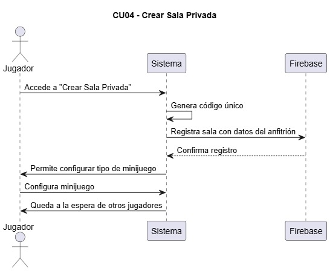

## CU01 - Autenticación de Usuarios  
El CU01 - Autenticación de Usuarios describe el flujo de interacción para el proceso de autenticación  

## CU02 - Registro de Usuarios  
El CU02 - Registro de Usuarios describe el flujo de interacción para el proceso de registrarse  

## CU03 - Gestión de Usuarios  
El CU03 - Gestión de Usuarios describe el flujo de interacción para el proceso de gestionar usuarios  

## CU04 - Crear sala privada  
El CU04 - Crear sala privada describe el flujo de interacción para el proceso de crear salas privadas  

## CU05 - Universe a una sala privada  
El CU05 - Universe a una sala privada describe el flujo de interacción para el proceso de unirse a salas privadas  

## CU06 - Universe a una sala pública  
El CU06 - Universe a una sala pública describe el flujo de interacción para el proceso de unirse a salas públicas  

## CU07 - Gestión de estado de usuario  
El CU07 - Gestión de estado de usuario describe el flujo de interacción para el proceso de gestionar el estado  

## CU08 - Selección de minijuego  
El CU08 - Selección de minijuego describe el flujo de interacción para que el anfitrión elija un minijuego  

## CU09 - Detección de gestos en tiempo real  
El CU09 - Detección de gestos en tiempo real describe el flujo de interacción para que el sistema detecte los gestos del jugador  

## CU10 - Determinar automáticamente el ganador  
El CU10 - Determinar automaticamente el ganador describe el flujo para que el sistema determine el ganador de los minijuegos de forma automática  

## CU11 - Expulsar jugador  
El CU11 - Expulsar jugador describe el flujo de interacción para que el anfitrión expulse a un jugador de la sala  

## CU12 - Detección de gestos inapropiados  
El CU12 - Detección de gestos inapropiados describe el flujo de interacción para que el sistema detecte automaticamente los gestos inofencivos  

## CU13 - Ver estadísticas del jugador  
El CU13 - Ver estadisticas del jugador describe el flujo de interacción para que el usuario pueda visualizar sus estadisticas  

