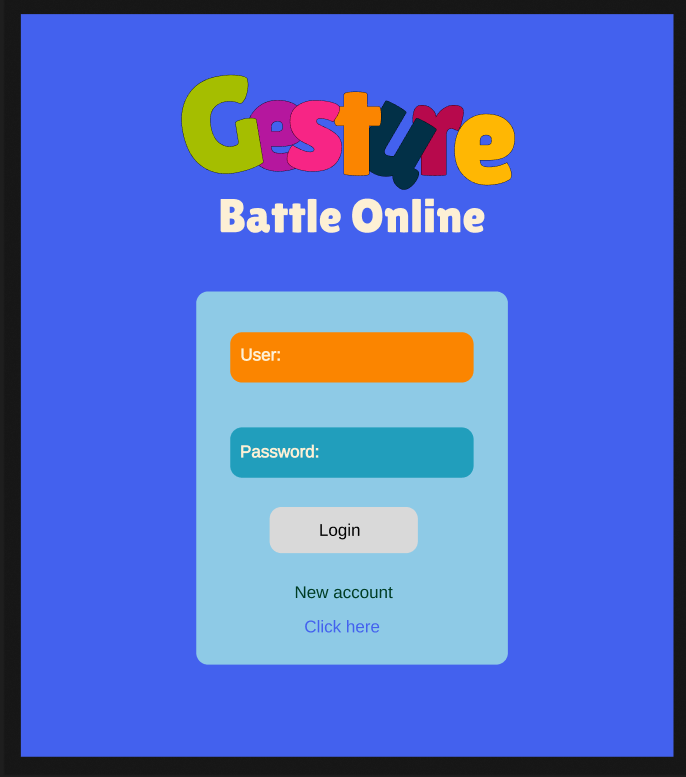
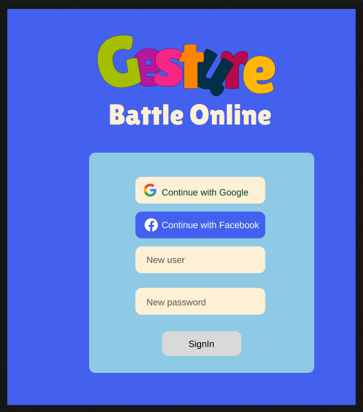
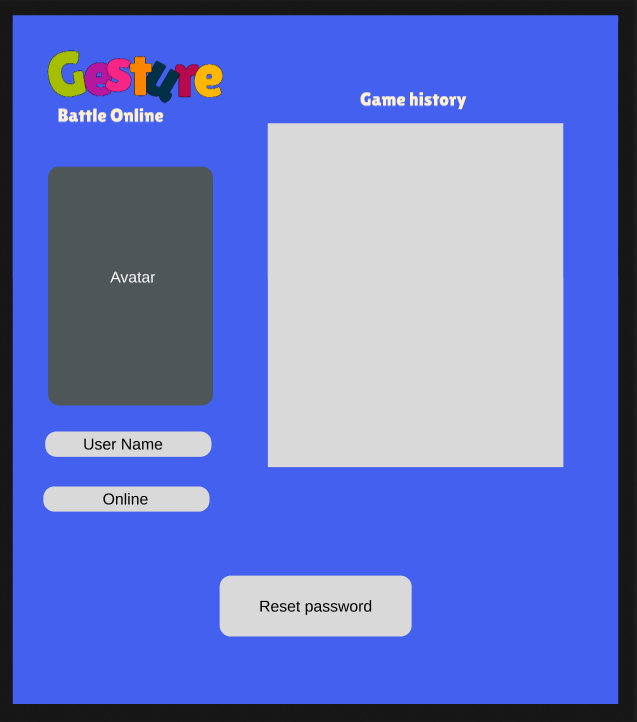
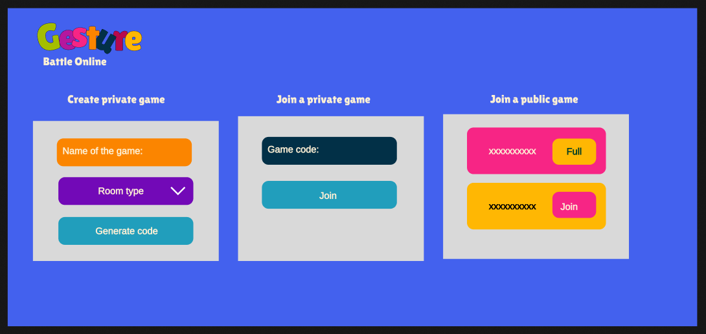
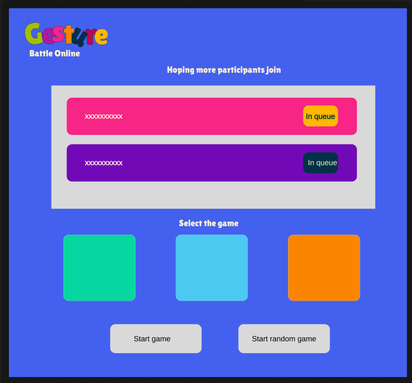
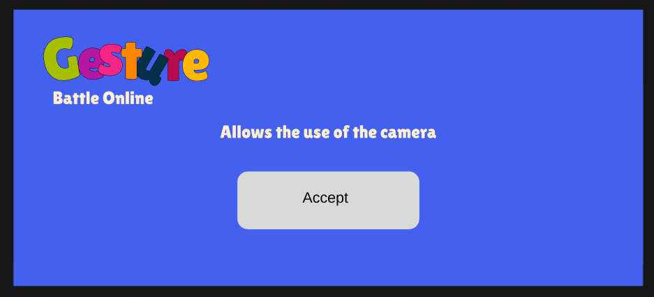
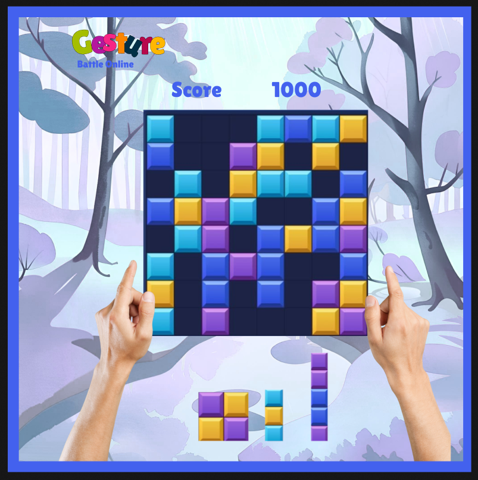
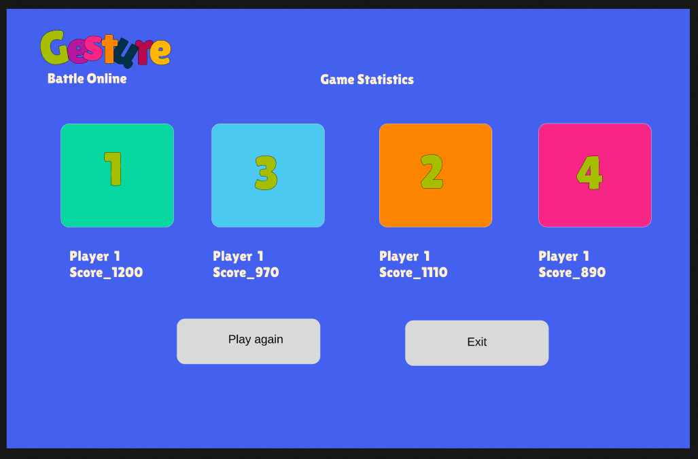

<h1>Interfaces gráficas</h1>

<h2>Interfaz del Login</h2>

Esta interfaz permite realizar el login de usuario a través de usuario y contraseña, o crear una nueva cuenta

    <h2>Interfaz de crear cuenta</h2>
    
Esta interfaz permite crear una cuenta, y entrar por google o facebook

    <h2>Interfaz de configuración de usuario</h2>
    
En esta interfaz cada usuario podrá visualizar el historial de partidas, su avatar, el nombre de usuario y el estado (online etc), además de poder cambiar la contraseña

    <h2>Interfaz de menú del crear juego</h2>
    
En esta interfaz el usuario podrá crear partidas privadas, unirse a partidas privadas mediante el código, o unirse a partidas públicas habilitadas

    <h2>Interfaz del menú del videojuego</h2>
    
En esta interfaz el usuario podrá visualizar los jugadores dentro de la partida, seleccionar el minijuego que desean, iniciar con el videojuego seleccionado o iniciar con un videjuego seleccionado de forma aleatoria

    <h2>Ventana emergente de autorización para usar al cámara</h2>
    
En esta ventana emergente el usuario dará autorización del uso de su cámara para los minijuegos

    <h2>Interfaz de un minijuego</h2>
    
En esta interfaz el usuario podrá jugar el minijuego, visualizando las manos en la pantalla para realizar los gestos

    <h2>Interfaz de las estadisticas al finalizar el juego</h2>
    
En esta interfaz el usuario podrá visualizar las estatisticas propias y de cada jugador al momento de finalizar la partida, encontrando el nombre de usuario junto con la puntuación, la opción de jugar nuevamente y de salirse

